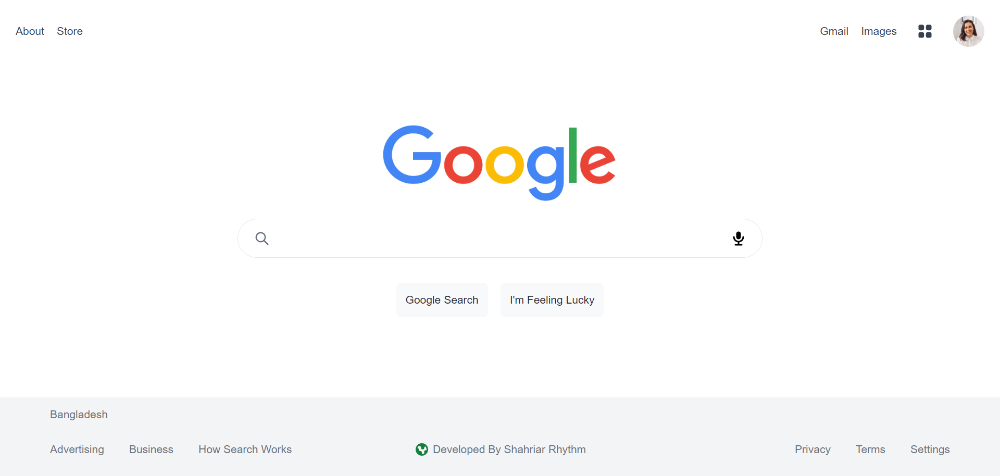

# Google-2.0
This is a clone of google. I have developed it using Next.js, Tailwind CSS, Vercel.

### Deployment
| Environment | Link |
|-------------|------|
| Vercel Hosting | [Vercel Preview](https://google-2-0-ixxt04qn5-rhythm1950.vercel.app/) |

### Technology Stack
#### Frame-Works, PlatForm & Libraries:
- 
- 
- 

#### IDE Used:
- 

#### Version Control:
- 
- 

#### Hosting Server:
- 

### Website Preview:

